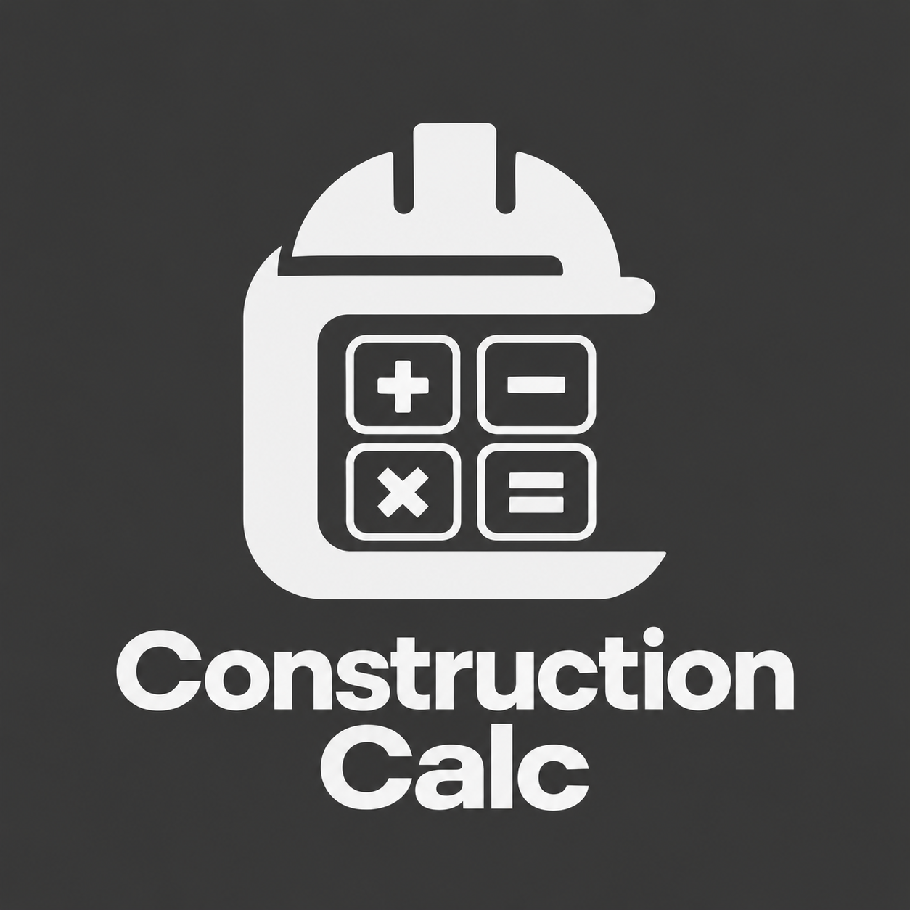

# Construction Calc

<p align="center">
  
</p>

<p align="center">
  Şantiye ve ofis için geliştirilmiş, yalnızca Android APK olarak dağıtılan ölçü ve mühendislik hesap makinesi.
</p>

<p align="center">
  <a href="README.md">🇹🇷 Türkçe</a> · <a href="README.en.md">🇺🇸 English</a>
</p>

<p align="center">
  
  
  
</p>

<p align="center">
  <a href="https://github.com/GloriousApps/Construction-Calc/releases">APK indir</a> ·
  <a href="https://github.com/GloriousApps/Construction-Calc/issues">Sorun bildir</a>
</p>

## Özellikler

- Feet, inch ve yard girişleri; `5 FEET 3 1/2 INCH` biçiminde canlı ölçü oluşturma ve geri alma
- Aynı birim tuşuyla `INCH → SQUARE INCH → CUBIC INCH` boyut döngüsü
- Alan ve hacim hesapları; sonuçlarda tam birim etiketleri
- `Conv` ile feet–inch–yard dönüşüm zinciri
- Store, Rcl, M+, M−, MC hafıza işlemleri ve ekrandaki M göstergesi
- Tape/Geçmiş kaydı; sonuçları yeniden kullanma
- Ayarlar: kesir hassasiyeti (1/2–1/64), normal/mühendislik ondalık hane (1–6), otomatik/dikey/yatay görünüm
- Koyu tema ve Android haptic geri bildirim
- Aero Glass tema: renkleri koruyan parlak cam tuşlar, yansıma, derinlik ve ince ışık çerçeveleri

## Geliştirme

```bash
npm install
npm run dev
```

İmzalı Android APK üretmek için:

```bash
npm run build
npx cap sync android
cd android
./gradlew assembleRelease
```

## Dağıtım

Bu proje web sitesi veya masaüstü sürümü yayınlamaz. GitHub Actions, her sürüm için yalnızca Android APK üretir ve [GitHub Releases](https://github.com/GloriousApps/Construction-Calc/releases) altında yayınlar.
